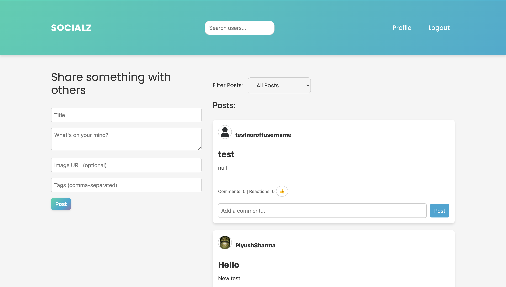
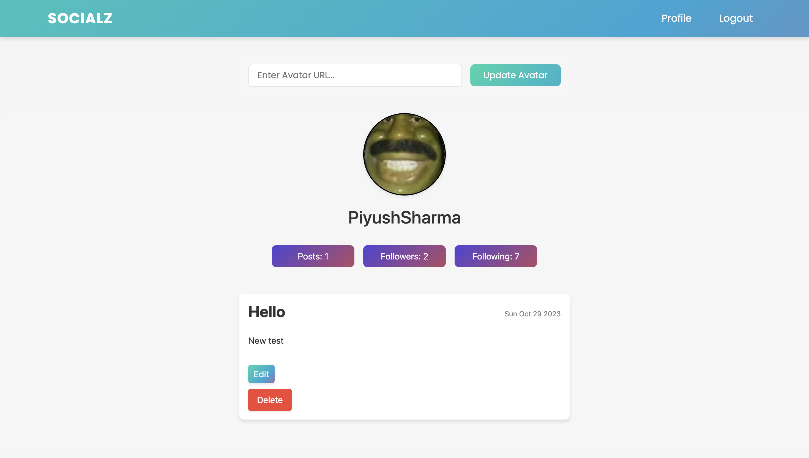
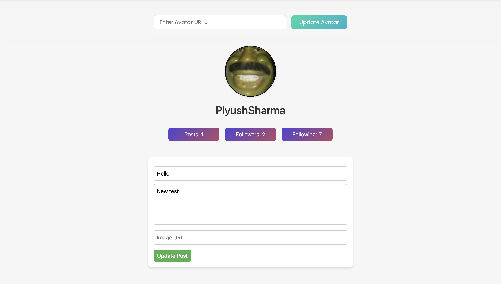

# Socialz - Javascript 2 Resit

## Socialz Join the Conversation!


Built with Bootstrap, JavaScript, SCSS, and the Noroff API, this website offers a seamless social media experience:

- User Authentication: Secure login and registration using noroff.no or stud.noroff.no credentials.
- Interactive Posting: Create posts. React to and comment on posts from other users.
- Post Filtering: Quickly find the content you're interested in. Either latets posts or posts by who you follow.
- Profile: Update your avatar, see your posts and manage them easily.
- User interaction: Click on a username for a post to explore detailed user profiles and follow them.

Join us and dive into a fresh and engaging social media experience!!


## Homepage



## Follow


## Profile page



## Edit post



### To run this app:

 1. clone this repo
 2. open in integrated terminal

```
npm i
```
```
npm run build
```
```
npm run dev
```
3. Open your localhost in the browser.

- Repository: 
[Github]()

- Live demo link: 
[Live Demo]()


## Project Brief
