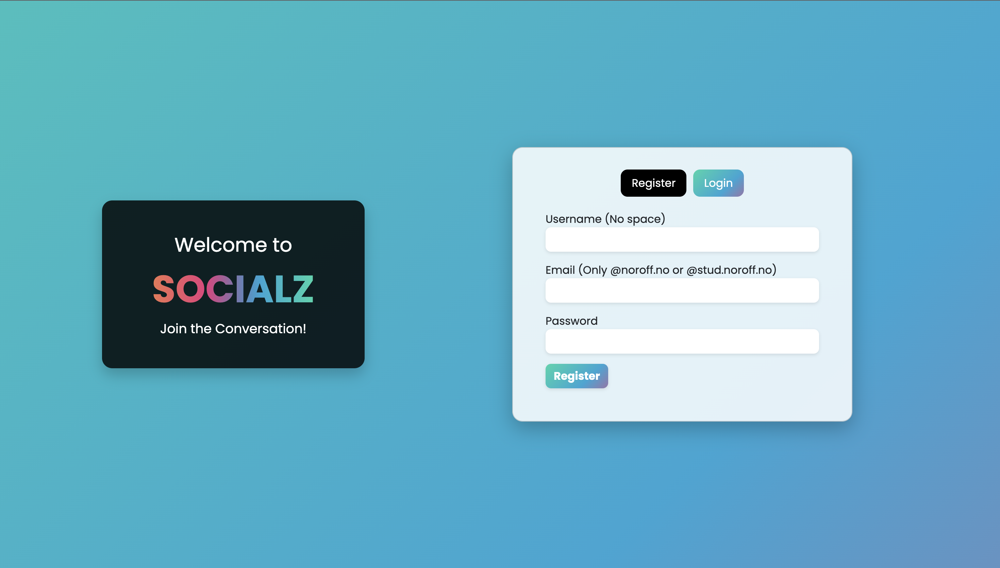

# Socialz - Javascript 2 Resit

## Socialz Join the Conversation!



Built with Bootstrap, JavaScript, SCSS, and the Noroff API, this website offers a seamless social media experience:

User Authentication: Secure login and registration using noroff.no or stud.noroff.no credentials.
Interactive Posting: Create posts. React to and comment on posts from other users.
Post Filtering: Quickly find the content you're interested in. Either latets posts or posts by who you follow.
Profile: Update your avatar, see your posts and manage them easily.
User interaction: Click on a username for a post to explore detailed user profiles and follow them.

Join us and dive into a fresh and engaging social media experience!!


## Search


## Login page


## Profile page


## Edit post page


### To run this app:

 1. clone this repo
 2. open in integrated terminal

```
npm i
```
```
npm run build
```
```
npm run dev
```
3. Open your localhost in the browser.

### Report:

Since I started learning React, my understanding of JavaScript has improved a lot, and I can now build websites using both Bootstrap and JavaScript. At the beginning of the semester, I had a hard time with these concepts, but now I feel more confident and in control.

React has been particularly helpful in teaching me JavaScript. It breaks down complex tasks into smaller, reusable parts called components. This makes my work easier and my code more efficient. React also helps me manage data in a clear and organized way, which is important for maintaining my code over time.

Working with React has also improved my knowledge of JavaScript itself. I have learned about functions, variables, data types, and how to control the flow of my code. These are all essential skills for creating interactive websites.

Combining React with Bootstrap has allowed me to make websites that look good and work well on different devices. Bootstrap provides ready-made styles and components, which makes it easier to create attractive user interfaces. With React, I can add dynamic features to these interfaces, making them more interactive and engaging.

Overall, my experience with React, Bootstrap, and JavaScript has been really beneficial. I have overcome my initial struggles and gained more confidence in building websites. I am excited to continue learning and improving my skills in web development.


## Links

- Design and prototype:
[Figma](https://www.figma.com/file/vCb92sWz2I7PEzu7IxoA3Y/Semester-project-2-resit?type=design&node-id=0%3A1&mode=design&t=2DABpmYanmAJ8mTM-1)

- Repository: 
[Github](https://github.com/Noroff-FEU-Resits/semester-project-2-resit-piyushsharma1209.git)

- Live demo link: 
[Live Demo](https://dainty-starship-ee5049.netlify.app/)


## Project Brief
You have been tasked with creating a wiki-style website for front-end developers to store information about coding including syntax, and examples of how to create elements for a site. Here are a list of functional requirements:

All users should be able to see a list of posts.
All users should be able to search for a specific post. You can use client-side filtering, or use the search parameter on the API itself.
A user should be able to log in
A user who hasn’t logged in shouldn’t be able to edit any of the entries on the site.
A logged in user should be able to create a post
A logged in user should be able to update a post -A logged in user should be able to delete a post
You should use WordPress as a headless CMS to manage the content. It’s important to note that the editing of the content should happen on the front-end built by you, not the WordPress admin panel. You need to be making PUT and POST requests yourself to maintain the content on the site, and be fetching content from the WordPress REST API.

The API that you create and serve through WordPress is one part of the project. You’re just using WordPress for the API it gives you.

The second part of the project is the front-end code; a completely distinct project.