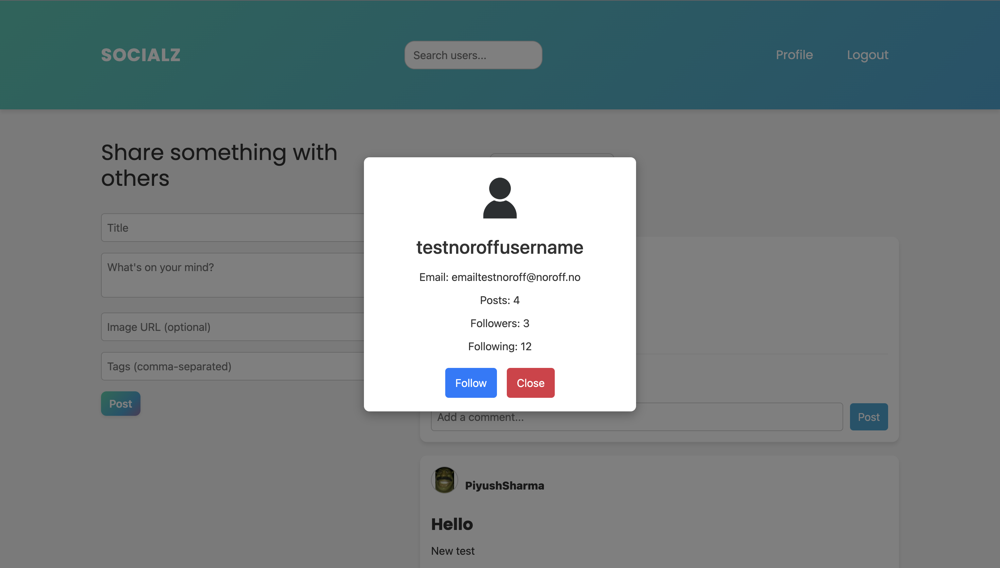

# Socialz - Javascript 2 Resit

## Socialz Join the Conversation!


Built with Bootstrap, JavaScript, SCSS, and the Noroff API, this website offers a seamless social media experience:

- User Authentication: Secure login and registration using noroff.no or stud.noroff.no credentials.
- Interactive Posting: Create posts. React to and comment on posts from other users.
- Post Filtering: Quickly find the content you're interested in. Either latets posts or posts by who you follow.
- Profile: Update your avatar, see your posts and manage them easily.
- User interaction: Click on a username for a post to explore detailed user profiles and follow them.

Join us and dive into a fresh and engaging social media experience!!


## Homepage


## Follow



## Profile page


## Edit post


### To run this app:

 1. clone this repo
 2. open in integrated terminal

```
npm i
```
```
npm run build
```
```
npm run dev
```
3. Open your localhost in the browser.

- Repository: 
[Github](https://github.com/piyushsharma1209/Socialz)

- Live demo link: 
[Live Demo](https://socialz.netlify.app/)


## Project Brief
Required features
The following user stories are required for a passing submission:

- User with @noroff.no or @stud.noroff.no email can register profile
Registered user can login (Done)
- User can view a post content feed (Done)
- User can filter the post content feed (Done)
- User can search the post content feed (Done)
- User can view a post content item by ID (Done)
- User can create a post content item (Done)
- User can update a post content item (Done)
- User can delete a post content item (Done)

Additional features
The following user stories are optional:

- User can create a comment on a post (Done)
- User can edit profile media (Done)
- User can follow/unfollow a profile (Done)
- User can react to a post content item (Done)